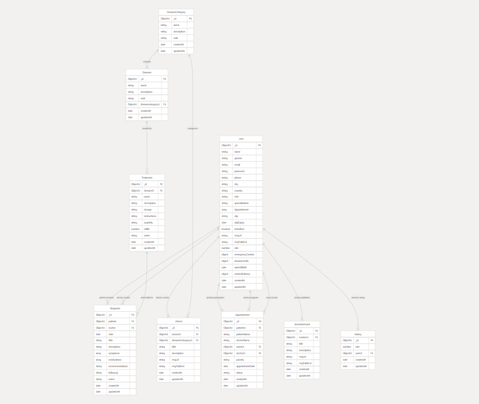

# Backend_GP


## Overview
Backend_GP is a Node.js backend project designed to manage users, appointments, diseases, treatments, and more for a healthcare or general practice application. It provides RESTful APIs for various resources and includes authentication, email services, and OTP verification.

## Features
- **User Management:** Register, login, and manage user data.
- **Appointment Scheduling:** Book, update, and manage appointments.
- **Disease & Treatment Management:** CRUD operations for diseases, disease categories, and treatments.
- **Advice System:** Manage and provide medical advice.
- **OTP Verification:** Secure user actions with OTP sent via email.
- **Authentication & Authorization:** Secure endpoints using JWT and middleware.
- **Email Service:** Send emails for OTP and notifications.
- **Blacklist:** Manage blacklisted users or tokens.

## Project Structure

```
backend/
│   app.js                  # Main application entry point
│   package.json            # Project dependencies and scripts
│   Readme.md               # Project documentation
│   Dockerfile              # Docker configuration
├── controllers/            # Route handler logic
│     advertisement.controller.js
│     advice.controller.js
│     ai.controller.js
│     appointmentController.js
│     blacklist.js
│     conversation.js
│     diagnosis.controller.js
│     diseases.controller.js
│     diseasesCategory.controller.js
│     doctor.controller.js
│     interaction.controller.js
│     message.js
│     oauth.controller.js
│     otp.controller.js
│     patient.controller.js
│     pdf.controller.js
│     rating.controller.js
│     token.js
│     treatment.controller.js
│     user.js
├── helpers/                # Utility/helper functions
│     errorHandler.js
│     images.js
│     invalidateCache.js
│     invalidateDiagnosesCache.js
│     OTP.helpers.js
│     redisClient.js
├── Mail/                   # Email service and templates
│     emailService.js
│     transporter.js
│     templates/
│         AppointDelete.template.js
│         confirmation.template.js
│         confirmed.template.js
│         invalidConfirmation.template.js
│         OTP.template.js
├── middlewares/            # Express middlewares
│     auth.js
│     cache.js
│     cacheForUser.js
│     cachePDF.js
├── models/                 # Mongoose models
│     advertisement.model.js
│     advice.model.js
│     appointmentModel.js
│     conversationModel.js
│     diagnosis.model.js
│     diseases.model.js
│     diseasesCategory.model.js
│     interaction.model.js
│     messageModel.js
│     ratingModel.js
│     treatment.model.js
│     userModel.js
├── PDF/                    # PDF generation and assets
│     medease-logo.jpg
│     service.js
├── routes/                 # API route definitions
│     advertisement.routes.js
│     advice.routes.js
│     ai.routes.js
│     appointment.js
│     conversation.router.js
│     diagnosis.routes.js
│     diseases.routes.js
│     diseasesCategory.routes.js
│     doctor.routes.js
│     interacrion.route.js
│     message.routes.js
│     oauth.routes.js
│     otp.routes.js
│     patient.routes.js
│     pdf.routes.js
│     rating.routes.js
│     treatmnet.routes.js
│     user.js
```

## Database Schema


## Getting Started

### Prerequisites
- Node.js (v14 or higher recommended)
- npm (Node Package Manager)
- MongoDB (local or cloud instance)

### Installation
1. Clone the repository:
   ```sh
   git clone <repository-url>
   cd backend_GP
   ```
2. Install dependencies:
   ```sh
   npm install
   ```
3. Configure environment variables:
   - Create a `.env` file in the root directory.
   - Add necessary variables (e.g., `MONGODB_URI`, `JWT_SECRET`, email credentials, etc.)

### Running the Application
Start the server with:
```sh
npm start
```
The server will run on the port specified in your environment variables or default to 3000.

## API Endpoints
The project exposes RESTful endpoints for all major resources. Example endpoints include:
- `/api/user` - User registration, login, profile
- `/api/appointment` - Appointment management
- `/api/diseases` - Disease information
- `/api/treatment` - Treatment information
- `/api/advice` - Medical advice
- `/api/otp` - OTP operations
- `/api/advertisement` - Advertisements
- `/api/doctor` - Doctor information
- `/api/patient` - Patient information
- `/api/conversation` - Conversations
- `/api/diagnosis` - Diagnosis
- `/api/rating` - Ratings
- `/api/pdf` - PDF generation
- `/api/ai` - AI endpoints

Refer to the route files in the `routes/` directory for detailed endpoint definitions. Note: Some route files may have minor typos in their names (e.g., `treatmnet.routes.js`, `interacrion.route.js`).

## Contributing
Pull requests are welcome. For major changes, please open an issue first to discuss what you would like to change.

## License
This project is licensed under the MIT License.
